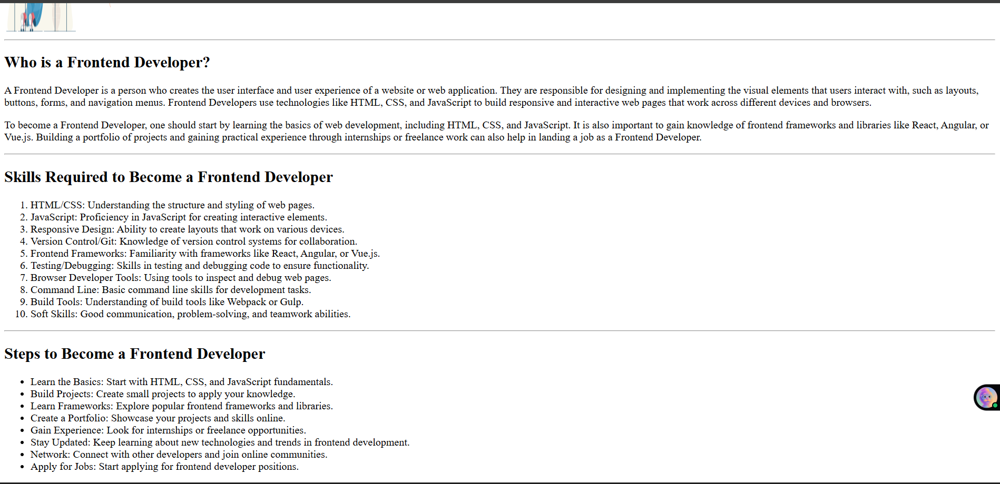

# 🚀 BR-Frontend-Training

This repository is created as part of my **Frontend Training Program**.  
It contains daily tasks focused on building strong frontend fundamentals step by step.

---

## 📅 Day 1 Task: Basics of HTML

### 🎯 Objective
To understand the **fundamentals of HTML** and apply them by creating a small static webpage.

---

## 🧠 Concepts Learned (Day 1)

- Basic structure of an HTML document  
- HTML tags and elements  
- Headings (`<h1>` to `<h6>`)  
- Paragraphs and text formatting  
- Anchor tags (`<a>`)  
- Image tags (``)  
- Lists (Ordered & Unordered)  
- Basic form elements  
- Introduction to semantic HTML  

---

## 🛠️ Practical Implementation

As part of **Day 1 practice**, I created a **simple HTML webpage** using the concepts learned.

### ✨ Features of the Webpage
- Proper HTML boilerplate structure  
- Use of headings and paragraphs  
- Images and hyperlinks  
- Simple and clean layout for practice  

---

## 🖼️ Practice Webpage Preview

Below is the screenshot of the webpage created during ****:

```md

